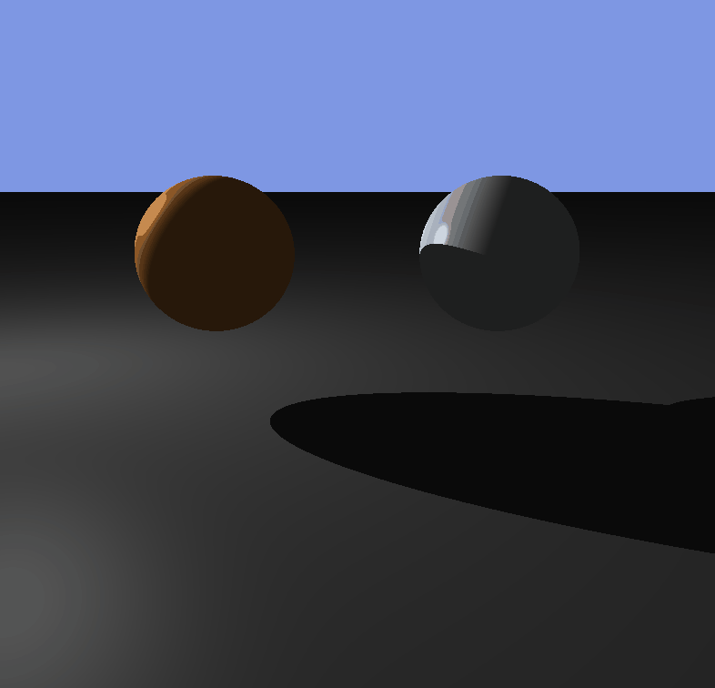

# RayTracer

*Work in progress*

This is my Ray Tracer/Caster implementation.

## Generating solution on Windows:

* Install VS v140 C++ toolkit.
* Run this in console: 

cmake -G "Visual Studio 15 2017 Win64" -H. -Bbuild -T v140

## Working with MacOS:
* Install VS Code
* Install cmake
* Install C++ plugin for VS Code
* Install XCode (contains C++ build tools)
* Within VS Code press Command + Shift + P and run **CMake: Build a Target** (Choose RayCaster)

